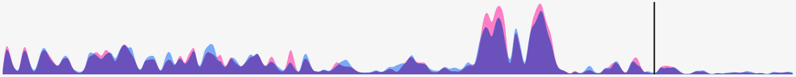

# Felds / Clipit

It aims to make clipping audio fun, convenient and pretty.

This is the product of my studies on how to read, manipulate and plot sound using React and D3 and, in the future, using WASM to compile the end result.

## To dos

- [ ] Move the audio processing to a higher level component so it can be used by multiple visualizations
- [ ] Make it work on Safari
- [ ] Allow putting the playhead anywhere without clearing the brush

### Done
